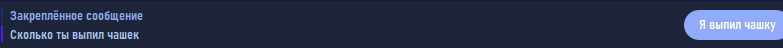
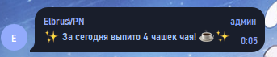
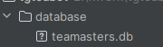
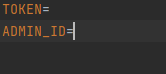
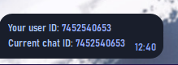

Для активации бота администратор из .env файла прописывает /init

Уведомления о выпитых кружках чая в 00 00, 15 30, 11 00  МСК
так же можно вызвать командой /notify

Для старта бота добавьте его в группу, ЖЕЛАТЕЛЬНО дайте права на удаление сообщений

Данные хранятся в Sqlite3 Базе Данных в папке database

Данные администратора*, токен бота указываются в .env файле:

* Данные администратора - его Чат Айди, если не знаете где взять - @getmyid_bot
  (или просто напишите в поиске телеграм get id

)

Бота можно добавлять в другие группы; доступ имеет только защищенный администратор

Запуск бота: python main.py